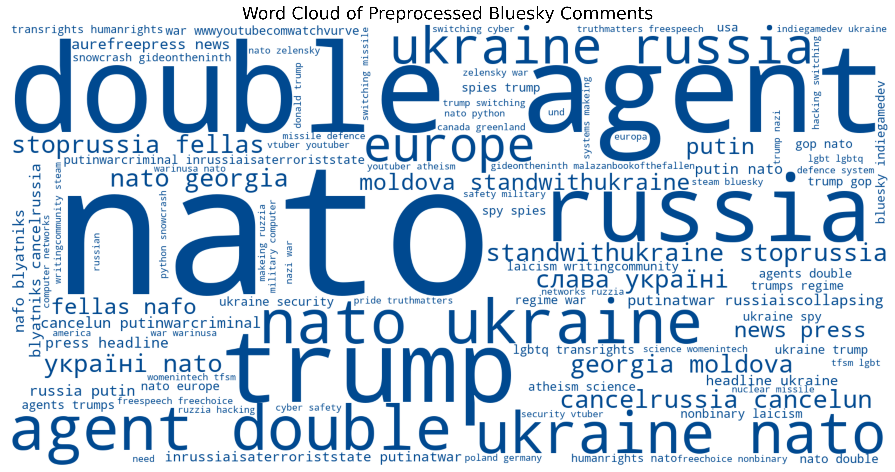
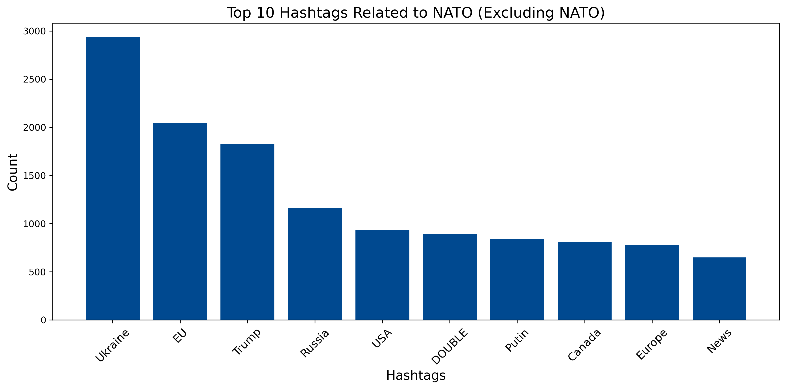
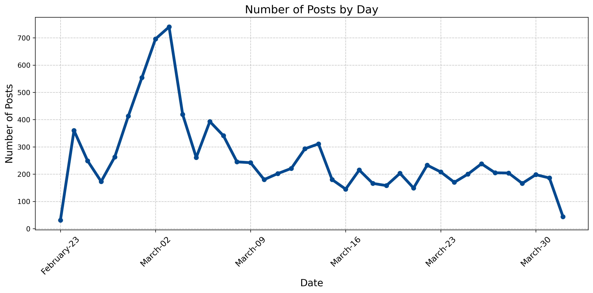

# Bluesky Scraping NATO Project :compass:

This project is dedicated to scraping posts containing the hashtag **#NATO** from the Bluesky social network. It performs a firsthand data analysis by collecting, processing, and visualizing posts to help identify trends and popular hashtags in the online discourse surrounding NATO. It is mostly an unstructured data analysis based on both the words in the posts and the hashtags commonly used with #NATO.

## Features

- **Data Scraping**:
  - Extracts posts containing specified hashtags ( '#NATO`) using Bluesky API ([At Protocol](https://atproto.com/)).
> **Note:** Due to the API's restriction I could only scrape the latest 9 856 posts, covering posts from March 2025 only.

- **Data Processing**:
  - Identifies hashtags, URLs, locations, and other key metadata from the posts.
  - Cleans and preprocesses text for further analysis.

- **Visualizations**:
  - Generates a **wordcloud** to highlight frequently used terms in posts.
  - Creates **bar charts** to show top hashtags realted to NATO.
  - Develops a **line chart** for the daily count of posts.

---

## Technologies Used

- **Languages**:
  - Python

- **Libraries**:
  - [Pandas](https://pandas.pydata.org/) - Data manipulation and analysis
  - [Matplotlib](https://matplotlib.org/) - Data visualization
  - [WordCloud](https://github.com/amueller/word_cloud) - Word cloud generation
  - [nltk](https://www.nltk.org/) - Natural language processing
  - [atproto](https://github.com/bluesky-social/atproto) - Bluesky API interaction

 ---
## Key takeways

  ### Basic Statistical Analysis for Numeric Columns
| Metric    | like_count | reply_count | repost_count |
|-----------|------------|-------------|--------------|
| **Mean**  | 2.880783   | 0.312906    | 0.894886     |
| **Std**   | 16.156901  | 0.960667    | 4.714724     |
| **Max**   | 908        | 25          | 272          |

> **Insights:** The social media engagement rate of 2.9%, if reduced to only likes, would be considered promising for this recent and growing network. A further analysis to assess its complete engagement rate would certainly help the digital marketing team. Also, the significant difference between the mean and the max across all three metrics from the 9,856 posts shows that only a few of them receive most of the attention from active viewers.

  ### Word Cloud from Scraped Posts

> **Insights:** Surrounding all NATO-related posts, the main topics are double agents, Trump, Ukraine, and Russia. There are certainly more investigations to be made regarding double agents and spies, as well as the origin and reposting of tags, to better understand whether there is some form of fake news. The other main words are quite straightforward and provide a good window into the current geopolitical reality since the beginning of 2022: European defense, which still heavily relies on NATO, is caught between diverging interests from the USA and Russia.

 ### Bar Chart of the top 10 Hashtags related to NATO

> **Insights:** The purpose of hashtags is mostly to help with web referencing and classify the main topics of posts. Hence, a hashtag comparison brings to light what people intuitively think about when posting about NATO. A similar observation can be made from this visual, which once again highlights the importance of Ukraine, Europe, Trump, and Russia when posting about NATO.

 ### Line Chart of the daily posts about NATO

> **Insights:** There is a peak of interest in NATO during the four days following the meeting between Zelensky and Trump on February 28th, with a 250% increase in daily posts using #NATO (rising from an average of about 200 to over 700). Bluesky posts are closely linked to daily news, reaffirming the role of social media in the spread of information.

 ---
## Further steps

- **Broaden the range of the study**: Working around the API's limit by creating an automated scrape that could append every day all daily posts. To fetch more historical posts since Bluesky's creation (2019) shold be possible and needs to be investigated.

- **Lead similar analysis from other social medias**: Mostly X.com since it generates the biggest amount of followers to almost all politicians (given a paid access to their API)

- **Create a geospatial analysis**: A map could show in a very effective way the origins of each tag and thus help understand located opinions.

- **Build a social network graph**: All accounts using #NATO could be analysised in term of their relations to each other in order to show intertwined connections for some particular topics.
